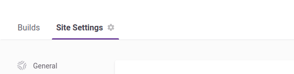
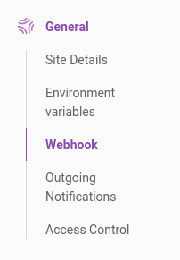
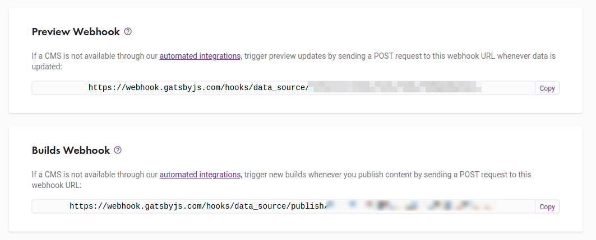
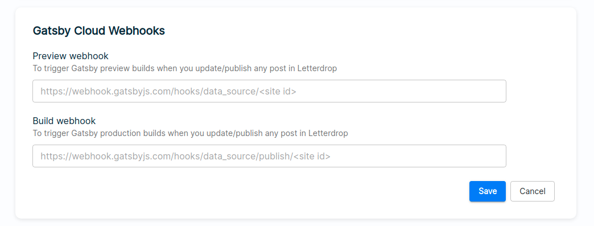

<!-- AUTO-GENERATED-CONTENT:START (STARTER) -->
<p align="center">
  <a href="https://www.gatsbyjs.com">
    
    
  </a>
</p>
<h1 align="center">
  Letterdrop's Gatsby blog starter
</h1>

## **Overview**
Kick off your project with this blog boilerplate. In this guide you’ll be setting up a CMS powered Gatsby site that uses Letterdrop as its content management system.

For this tutorial, you’ll need Letterdrop api-key of your publication which you can get by following instructions at [Finding and using your API key](https://api.letterdrop.com/find-your-api-key).

This starter ships with the main Gatsby configuration files you might need to get up and running blazing fast with the blazing fast app generator for React.

### **Prerequisites**

- You have a Letterdrop publication created. If not, create one using instructions [here](https://help.letterdrop.co/Create-a-publication-13c9df2117004cdb80f539a647e6483f).
- You have a pre-existing Gatsby project that uses gatsby-source-letterdrop on GitHub or GitLab. If not you can start with checking out [Letterdrop Gatsby Blog Starter](https://github.com/randomwalklabsco/gatsby-blog-letterdrop-cms)
- You are familiar with creating a Gatsby Cloud site from an existing GitHub or GitLab repository. Read [this guide](https://support.gatsbyjs.com/hc/en-us/articles/360059253654) for instructions on how to do this.


### Creating new site using Letterdrop's starter template:

***Step 1***

Clone the template project from [here](https://github.com/randomwalklabsco/gatsby-blog-letterdrop-cms) and run ``npm install`` in the root directory. 

***Step 2***

Go to ``gatsby-config.js`` file and replace the sample API key with your publication API key. You can leave it as it is to see how the template will look like when you run it.

***Step 3***

Inside root directory run ``npm run develop`` to start building the project. Once build you can open http://localhost:8000 (or if you prompted for using another port replace that value with 8000) in your browser to see the template result

### Creating new site using Gatsby's starter blog template:

When you choose to create a new site using Gatsby's starter template, you have to do changes for the configuration to connect to Letterdrop CMS.


- Add Letterdrop's source plugin into ``gatsby-config.js`` as following,

``` shell
{
  resolve: "@letterdropcom/gatsby-source-letterdrop",
  options: {
    apikey: "XXXXXX-XXXXXX", // sample Letterdrop publication key
    version: "v1",
  },
}
```
- Run ``npm install`` to install packages
- Install Letterdrop source plugin using ``npm i @letterdropcom/gatsby-source-letterdrop --save``
- You can run graphql queries to fetch data from plugin as following,
```shell
{
  allLetterdropPosts {
    nodes {
      url
      title
      ...
      coverImage {
        url
        extension
        ...
      }
      publication {
        customDomain {
          domain
          ...
        }
        _id
        domain
      }
    }
  }
}
```
- You can apply filters to fetch required post content alone as following,
``` shell
{
  allLetterdropPosts(filter: {url: {eq: "adapt-your-writing"}}) {
    ....
  }
}
```
- lets create a blog home:
``` shell
import * as React from "react"
import { Link, graphql } from "gatsby"

import Bio from "../components/bio"
import Layout from "../components/layout"
import Seo from "../components/seo"

const BlogIndex = ({ data, location }) => {
  const siteTitle = data.site.siteMetadata?.title || `Title`
  const posts = data.allLetterdropPosts.nodes

  if (posts.length === 0) {
    return (
      <Layout location={location} title={siteTitle}>
        <Seo title="All posts" />
        <Bio />
        <p>
          No blog posts found. Add markdown posts to "content/blog" (or the
          directory you specified for the "gatsby-source-filesystem" plugin in
          gatsby-config.js).
        </p>
      </Layout>
    )
  }

  return (
    <Layout location={location} title={siteTitle}>
      <Seo title="All posts" />
      <Bio />
      <ol style={{ listStyle: `none` }}>
        {posts.map(post => {
          const title = post.title || post.url

          return (
            <li key={post.url}>
              <article
                className="post-list-item"
                itemScope
                itemType="http://schema.org/Article"
              >
                <header>
                  <h2>
                    <Link to={post.url} itemProp="url">
                      <span itemProp="headline">{title}</span>
                    </Link>                    
                  </h2>
                  <small>{post.publishedOn}</small>
                  <small>
                    {post.postAuthor ? " - by " + post.postAuthor.name : ""}
                  </small>
                </header>
                <section>
                  <p
                    dangerouslySetInnerHTML={{
                      __html: post.subtitle || post.text,
                    }}
                    itemProp="description"
                  />
                </section>
              </article>
            </li>
          )
        })}
      </ol>
    </Layout>
  )
}

export default BlogIndex

export const pageQuery = graphql`
  query {
    site {
      siteMetadata {
        title
      }
    }
    allLetterdropPosts(sort: { fields: [publishedOn], order: DESC }, filter: {}) {
      nodes {
        id
        url
        title
        subtitle
        text
        publishedOn(formatString: "MMMM DD YYYY")
        coverImage {
          url
        }
      }
    }
  }
`

```
- run ``npm run develop`` to build the project once you created a bloghome using graphql query.

<br /><br />

### **Configuring webhooks**

Webhooks are a powerful feature that allow you to notify your internal systems whenever content in Letterdrop has changed. Your host platform needs to be notified so that Gatsby can create fresh pages from the new data.

To get the webhooks of your gatsby site:

- Open site settings from your Gatsby site dashboard 
<br /><br />

<br /><br />
- Click on General > Webhook from left navigation menu
<br /><br />

<br /><br />
- Copy "Preview Webhook" URL and proceed to publication settings in Letterdrop
<br /><br />

<br /><br />
- Scroll done to Gatsby Webhook section and paste into respective field for preview webhook
<br /><br />

<br /><br />
- Repeat aboce 2 steps for "Build Webhook" and save the settings in Letterdrop

<br /><br />

Gatsby will automatically start building project once you pushed changes into your git repository. Setting up webhooks will allow you to maintain latest data available in your website, fetching it from Letterdrop CMS whenever you publish/update/unpublish/delete posts from your publication.


### **Testing with GraphiQL**

You can test out your GraphQL queries with GraphiQL (a GraphQL debugger) fire up GraphiQL on http://localhost:8000/___graphql

Once GraphiQL is open, paste the query below :
```shell
{
  allLetterdropPosts {
    nodes {
      url
      title
      subtitle
      text
    }
  }
}
```
